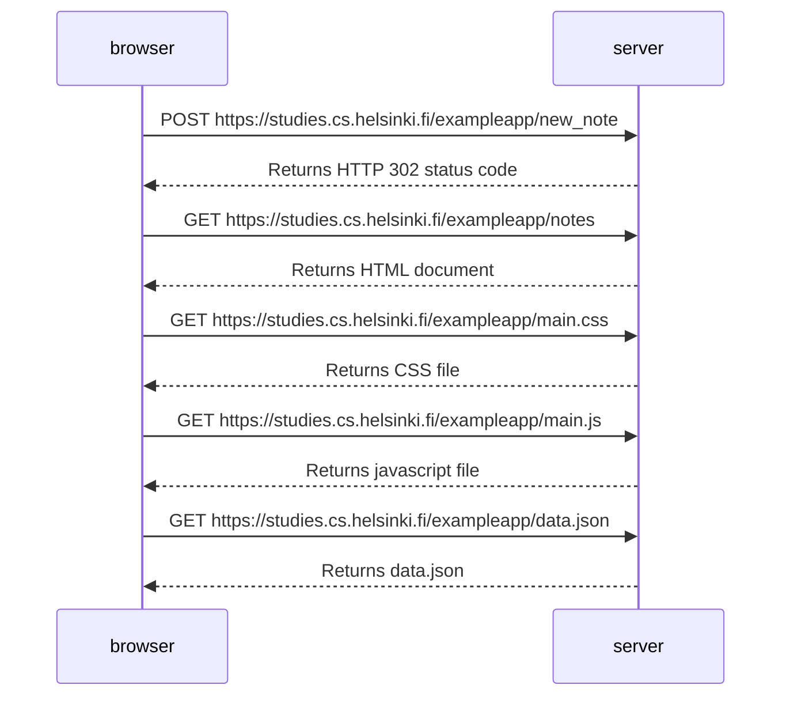

```mermaid
sequenceDiagram
participant browser
participant server

browser->>server: POST https://studies.cs.helsinki.fi/exampleapp/new_note
server-->>browser: Returns HTTP 302 status code
  %% 302 status code redirects the browser to another URL which in this case is "/notes" because it was defined by the action attribute on the initial html file as a result

browser->>server: GET https://studies.cs.helsinki.fi/exampleapp/notes
server-->>browser: Returns HTML document

browser->>server: GET https://studies.cs.helsinki.fi/exampleapp/main.css
server-->>browser: Returns CSS file

browser->>server: GET https://studies.cs.helsinki.fi/exampleapp/main.js
server-->>browser: Returns javascript file

browser->>server: GET https://studies.cs.helsinki.fi/exampleapp/data.json
server-->>browser: Returns data.json
```
