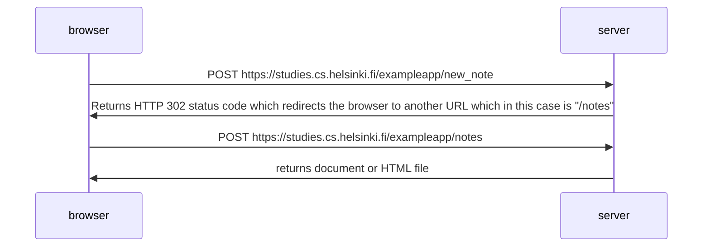

```mermaid
sequenceDiagram
participant browser
participant server

browser->>server: POST https://studies.cs.helsinki.fi/exampleapp/new_note
server->>browser: Returns HTTP 302 status code which redirects the browser to another URL which in this case is "/notes"

browser->>server: POST https://studies.cs.helsinki.fi/exampleapp/notes
server->>browser: returns document or HTML file
```
