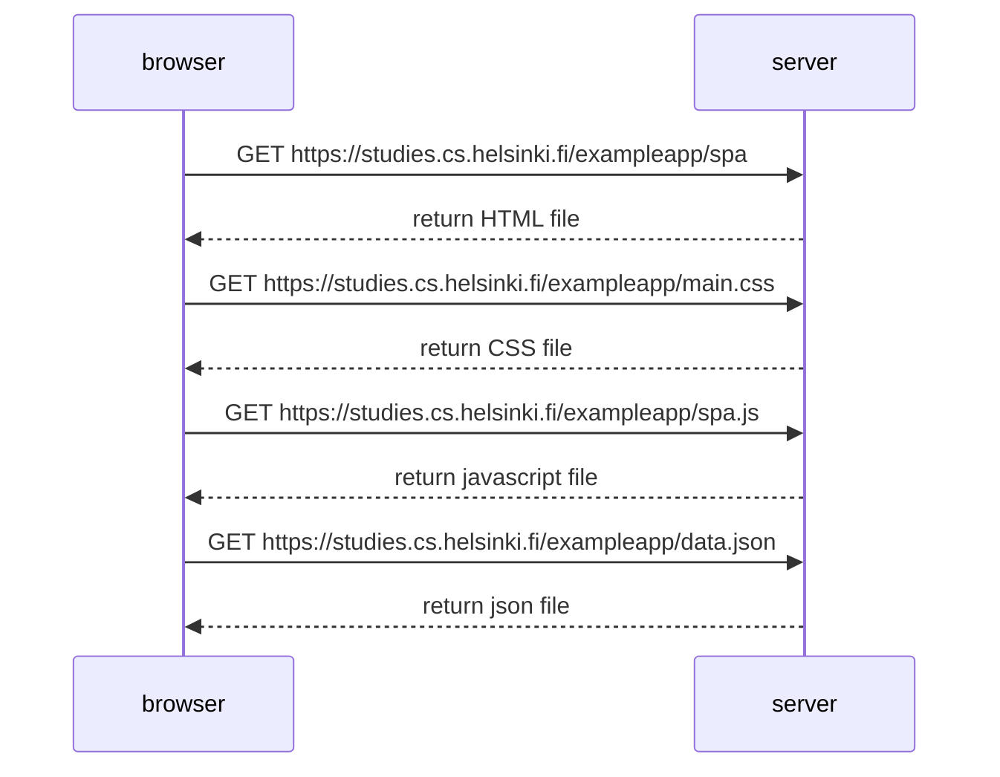

```mermaid
sequenceDiagram
  participant browser
  participant server

  browser->>server: GET https://studies.cs.helsinki.fi/exampleapp/spa
  server-->>browser: return HTML file

  browser->>server: GET https://studies.cs.helsinki.fi/exampleapp/main.css
  server-->>browser: return CSS file

  browser->>server: GET https://studies.cs.helsinki.fi/exampleapp/spa.js
  server-->>browser: return javascript file

  browser->>server: GET https://studies.cs.helsinki.fi/exampleapp/data.json
  server-->>browser: return json file
```
