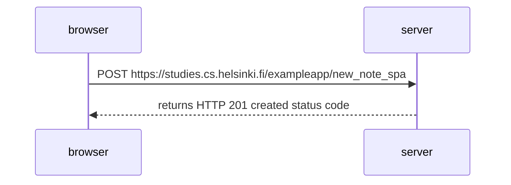

```mermaid
sequenceDiagram
  participant browser
  participant server

  browser->>server: POST https://studies.cs.helsinki.fi/exampleapp/new_note_spa
  server-->>browser: returns HTTP 201 created status code
   %% HTTP 201 created means that a new resource has been successfully created, the js code would then render that new note.
```
